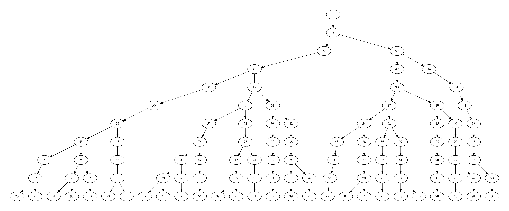

# RandomBTG



**RandomBTG** is a very simple random binary tree generator that allows you to create binary trees for using them as test cases in your programs. You can also render the result into a PDF, so you can see how beautiful your tree looks like. You can also configure things such as the total depth of the tree, minimum and maximum values for each node, the output file for the rendered graph and decide whether rendering PDF or simply generate the DOT file.

## Instructions

Want some beautiful trees now? Just run the following commands in a terminal:

```bash
pip3 install graphviz
chmod +x btg.py
./btg.py -h
```

## Credits

| Library  | Author         | License |
|----------|----------------|---------|
| Graphviz | Sebastian Bank | MIT     |